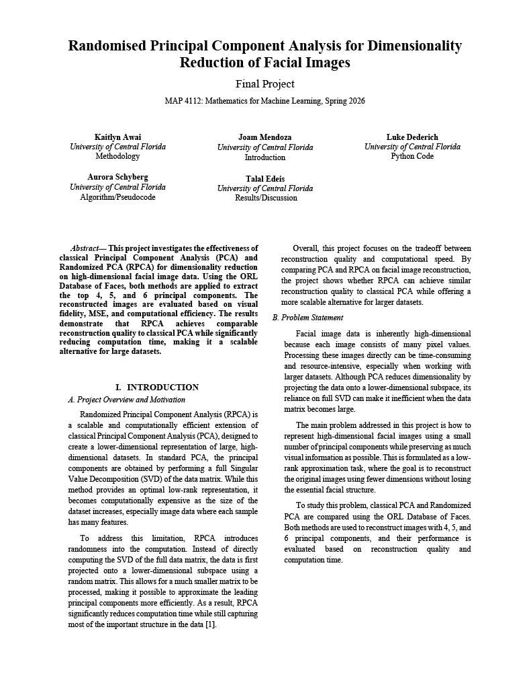
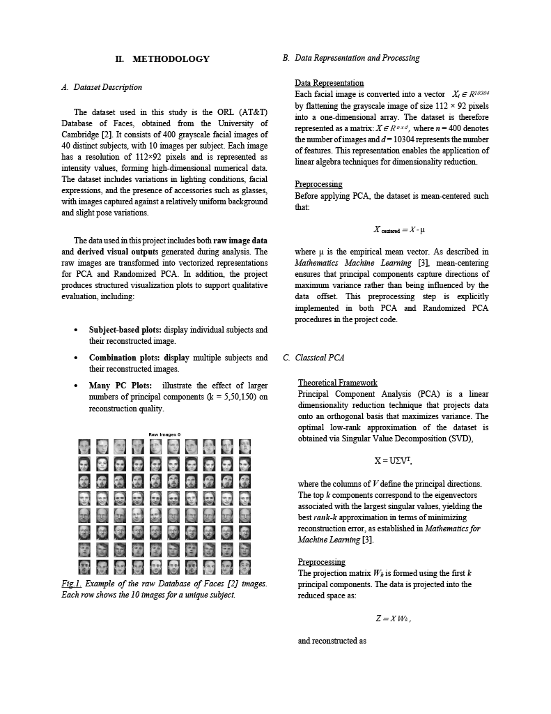
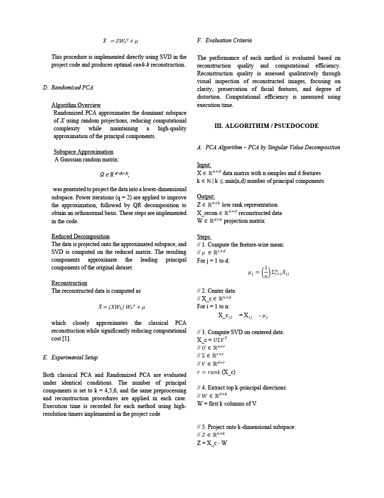
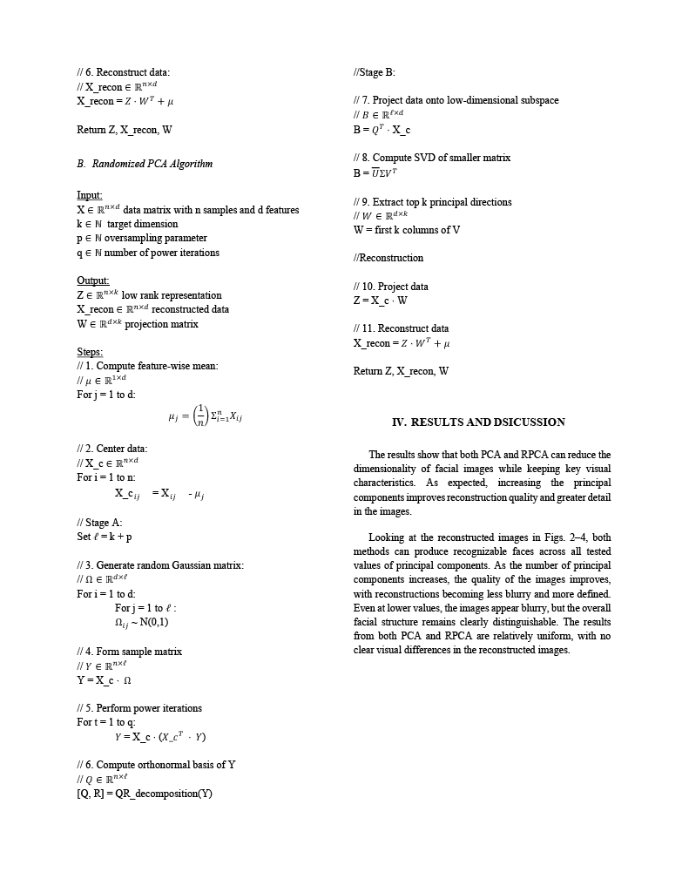
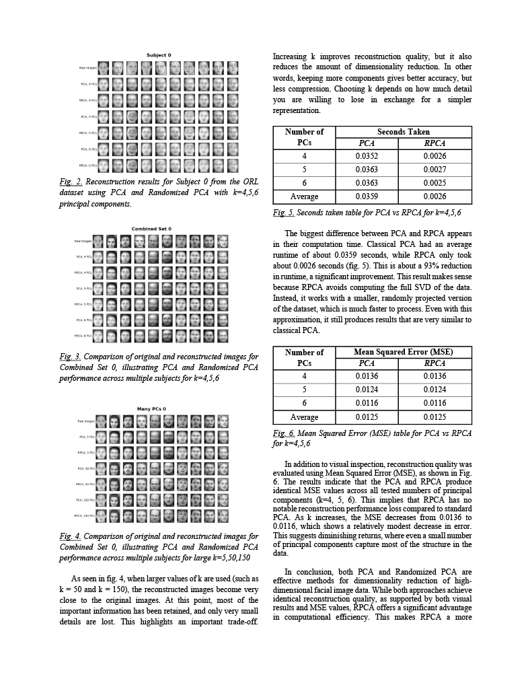
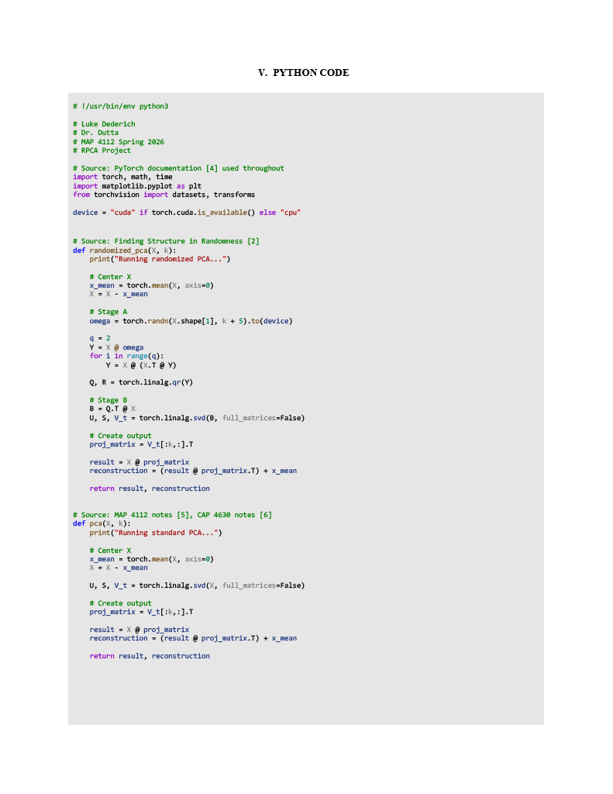
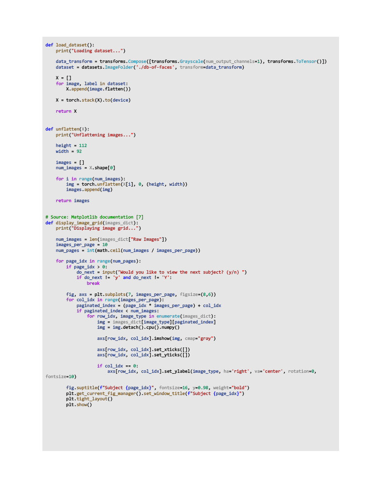
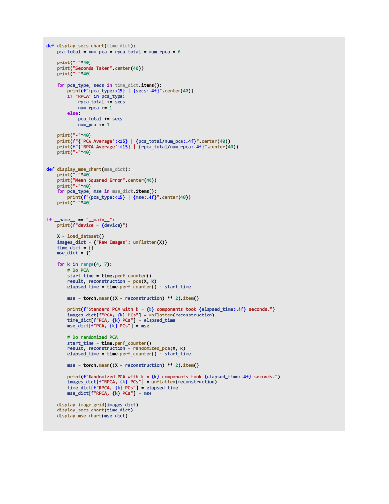
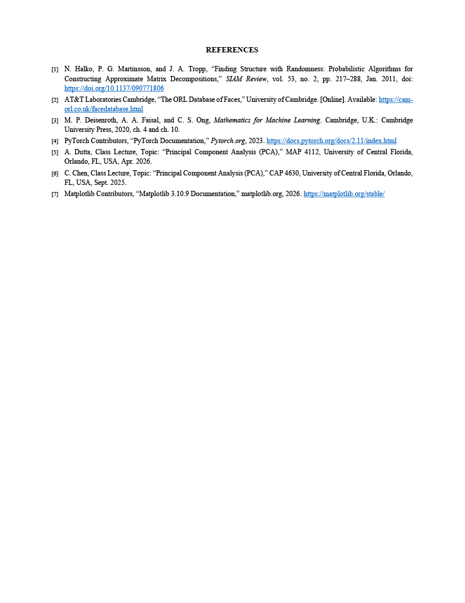

# PCA vs. RPCA
In **MAP4112, Mathematics for Machine Learning**, my peers and I had the opportunity to explore the tradeoffs between PCA and RPCA. 
I wrote the code and assisted with crafting the report; my peers did the primary writing. Due to the nature of this project, the
goal of my code was to demonstrate the mathematics behind PCA and RPCA (i.e., not just calling a function to make the code as 
efficient as possible) and balance that with practicality. I chose not to manually implement SVD because, using the methods described
in class, the manual implementation would be too slow, unlike the PyTorch implementation which contains many optimizations
(see [this link](https://docs.pytorch.org/docs/2.14/generated/torch.svd.html) for details). Explore our results and conclusions below.

  
The below code is identical to that in this repo, and redundant. It is included below for coherence with the sources on the last page.
  

